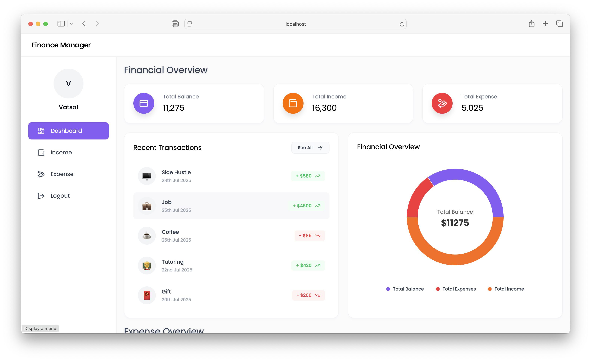
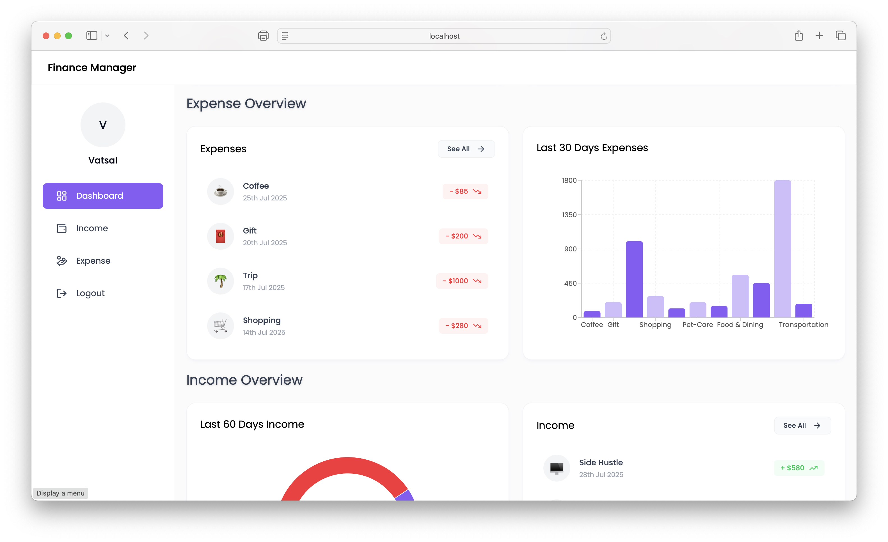
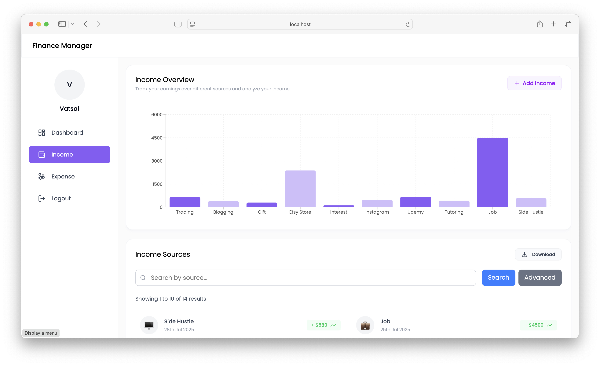
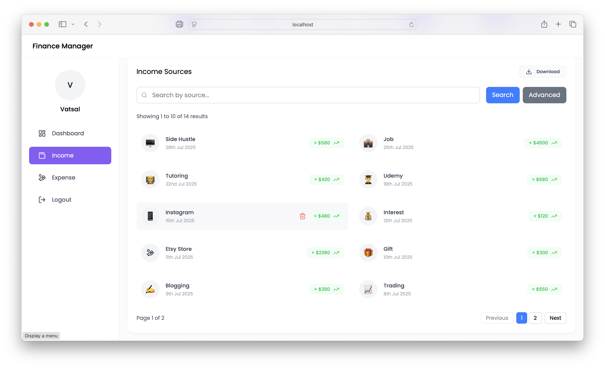
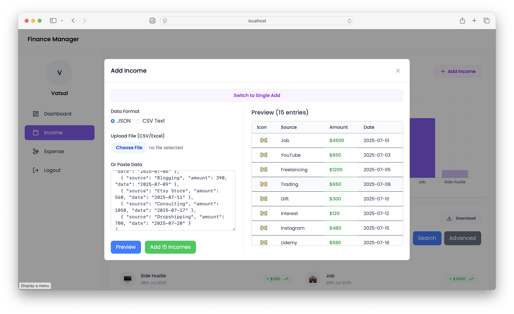
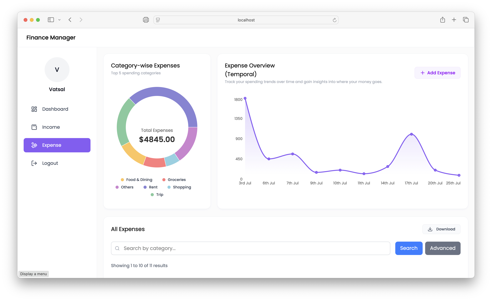
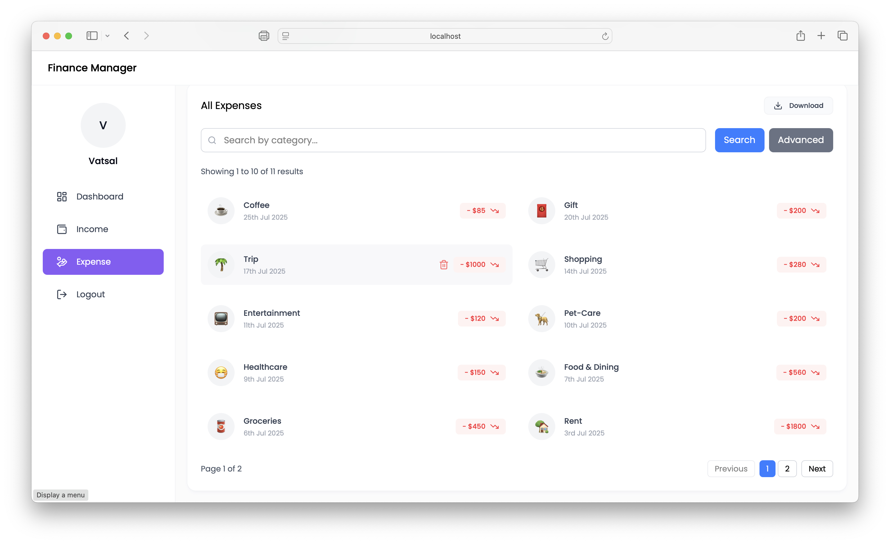
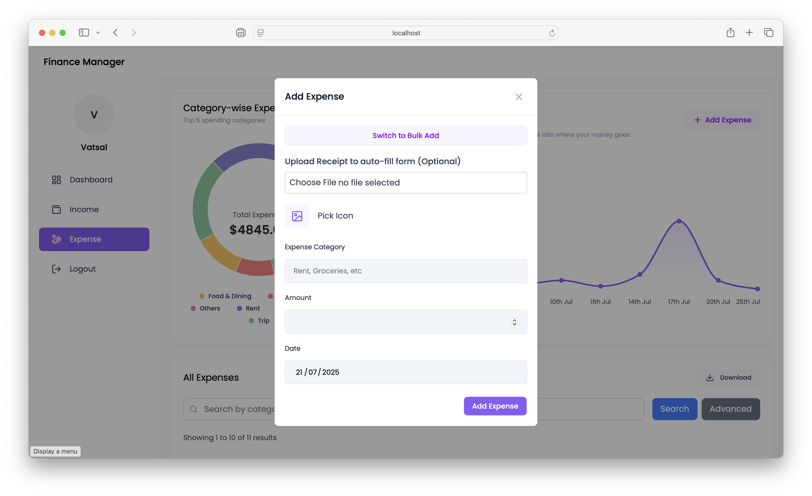

# 💰 Expense Management System

A comprehensive expense tracking and receipt processing application with three main components.  
✨ Features **AI-powered receipt reading** to automatically extract and process expense details from uploaded receipts.

---

## 🚀 Walkthrough

### 🏠 Dashboard

### 💵 Income Management

### 💳 Expense Management

### 📄 Add Expenses Using Receipts

### 📲 Authentication

---

## ⚙️ Components

### 🖥️ Backend

-   API server for expense management
-   Data processing and storage
-   RESTful endpoints

### 📊 Expense Tracker (Frontend)

-   Track daily expenses
-   Categorize transactions
-   View spending analytics
-   Export expense reports
-   User-friendly web interface

### 🤖 AI-Powered Receipt Processor

-   Upload receipt images
-   **AI-powered OCR** (using Tesseract.js) for intelligent receipt data extraction
-   Automatic expense categorization and processing
-   Standalone processing service

---

## 🛠 Technology Stack

### Backend

-   **Express.js** - Web framework
-   **Multer** - File upload handling
-   **Papa Parse** - CSV data processing
-   **XLSX** - Excel file handling
-   **Moment.js** - Date manipulation

### Receipt Processor

-   **Express.js** - Web server
-   **Tesseract.js** - OCR for receipt processing
-   **Multer** - File upload handling
-   **Node-fetch** - HTTP requests
-   **CORS** - Cross-origin resource sharing

### Frontend

-   Modern web interface
-   Responsive design
-   Real-time expense tracking

---

## 🚀 Getting Started

See [SETUP.md](SETUP.md) for installation and running instructions.
